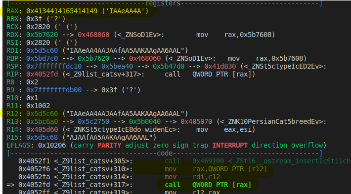
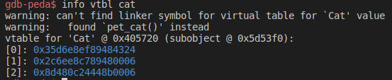
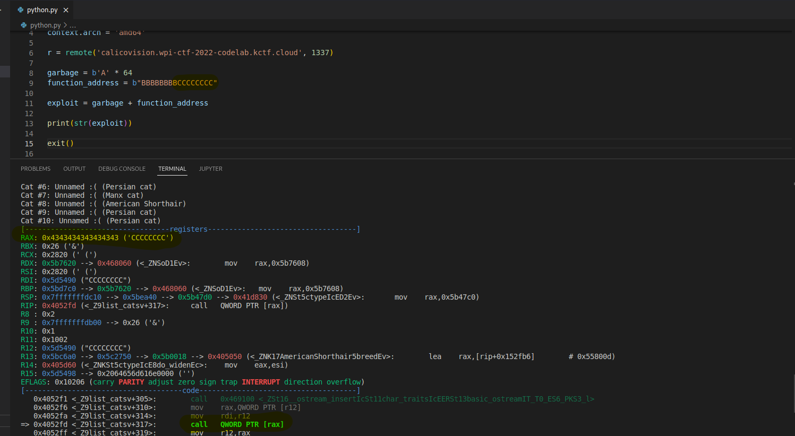
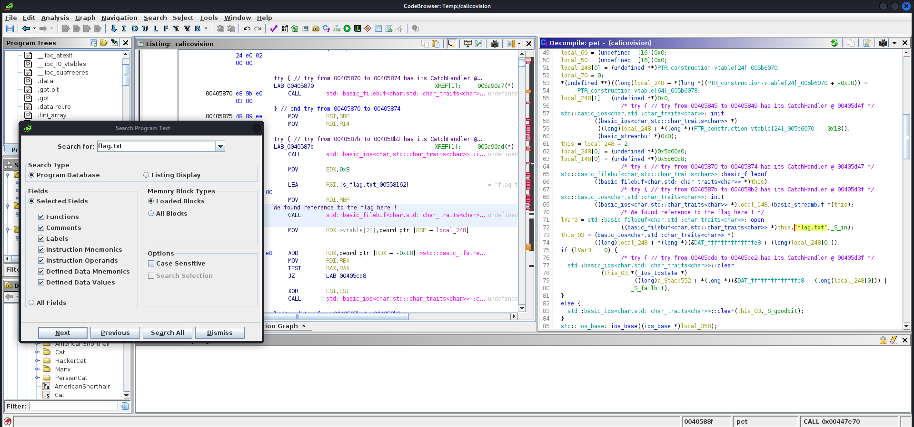
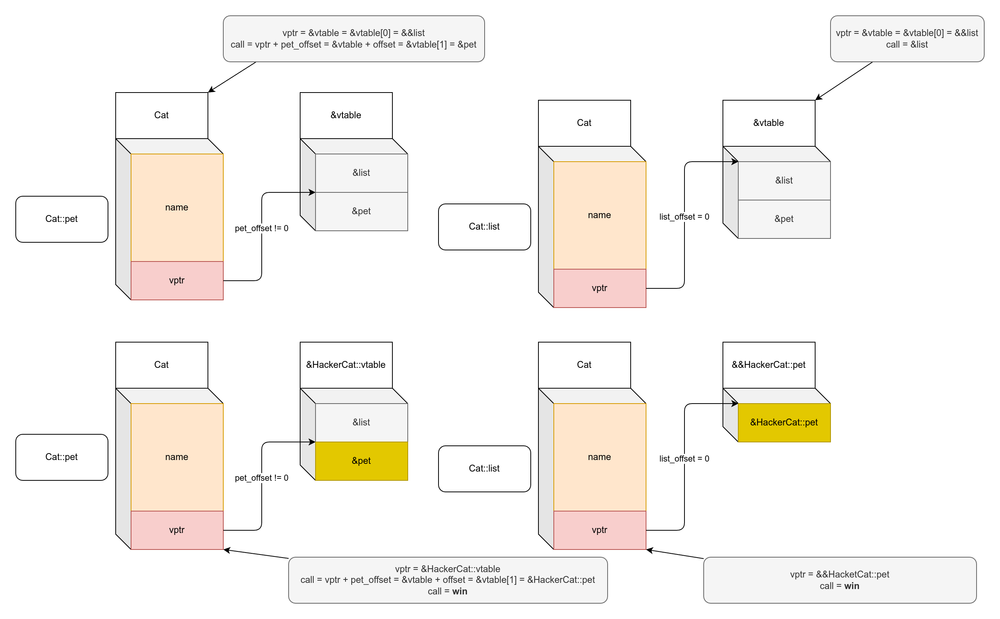
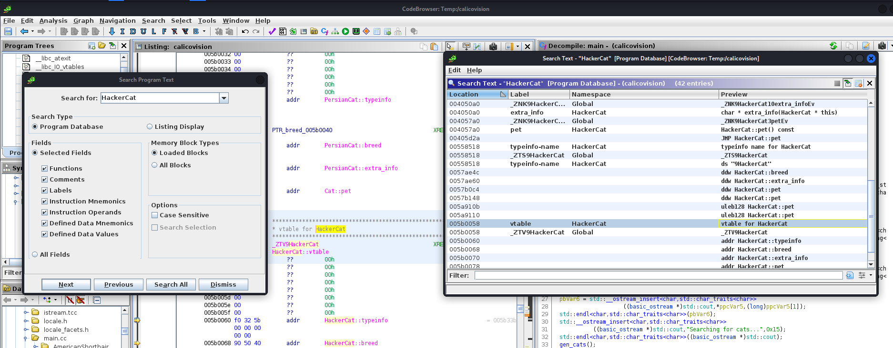

This post was written in 2022, but I had never posted it by accident. Published in October 2024.
{.note}

# Introduction

To continue our previous post about the WPICTF 2022 (online, hosted by [Worcester Polytechnic Institute Cyber Security Club](https://wpictf.xyz/)), we will focus our attention on a pwn challenge. And to change, this time we'll use [Ghidra](https://ghidra-sre.org/) rather than [Cutter](https://cutter.re/) 😎

A x64 ELF binary is provided with this challenge, no code is given.

## Recon

We explore the terminal user interface (TUI) of the binary, and we find the potential buffer overflow in the `B - Name a cat` submenu. Let's try to get the offset with [gdb-peda](https://github.com/longld/peda):
```shell
$ pattern create 100
$ r
B
[paste pattern]
A
[=> overflow (no RIP erase)]
$ pattern_search
[=> overflow (RAX erase and RIP pointing to call [RAX])]]
```

As we can see, it will not be that trivial to exploit the vulnerability since `RIP` is not directly controlled. However, we can see that `RIP` will point to a `call` instruction, with the function address stored in `RAX`, and `RAX` retrieve this function adress from the value pointed by `R12`:



So, to summarize:
- We can change what is pointed by `R12` with the overflow,
- This will change the value of `RAX`,
- `RAX` is then used as a function pointer in a `call`,
  
We can translate in pseudo-code what is happening `call *(*(R12))`, or simpler:
```r
R12 = &(overflow[??])
call *(*R12) = call *overflow[??]
```

Then, we can control the flow and if we change what is pointed by `R12` to a pointer to a vulnerable code, we win.

Without reversing we already have a lot of information, but to validate our hypothesis we will have to open [Ghidra](https://ghidra-sre.org/). We quickly find that the code is in C++ (good news) and therefore there is a lot of garbage code. We start to focus on the `Cat` structure (we can make the hypothesis that it's a class) and find some interesting information using the structure editor of Ghidra:


As we can see, the `Cat` class is composed of a `name` field of 64 bytes (where the overflow is happening) and a super interesting function pointer `vptr_Cat`. We know that this a sign of a `vtable` and confirm that `Cat` is a class, that surely deal with inheritance.

As a reminder of what a `vtable` is, let's read a bit of [Wikipedia](https://en.wikipedia.org/wiki/Virtual_method_table):

> In computer programming, a virtual method table (VMT), virtual function table, virtual call table, dispatch table, vtable, or vftable is a mechanism used in a programming language to support dynamic dispatch (or run-time method binding). Whenever a class defines a virtual function (or method), most compilers add a hidden member variable to the class that points to an array of pointers to (virtual) functions called the virtual method table. These pointers are used at runtime to invoke the appropriate function implementations, because at compile time it may not yet be known if the base function is to be called or a derived one implemented by a class that inherits from the base class. 

> Typically, the compiler creates a separate virtual method table for each class. When an object is created, a pointer to this table, called the virtual table pointer, vpointer or VPTR, is added as a hidden member of this object. As such, the compiler must also generate "hidden" code in the constructors of each class to initialize a new object's virtual table pointer to the address of its class's virtual method table. 

Since everything is better explained with a diagram, here is one:


If you want to delve deeper into the subject, a good reference is available here: [SMASHING C++ VPTRS](http://phrack.org/issues/56/8.html). We can see the `vtable` in `gdb`:



So, we know via `gdb` that we need to deal with a function pointer to exploit the buffer overflow, and we just saw that the overflowable `Cat` class contains a `vptr`. We are close to victory, now we just have to make a choice to exploit the situation:
- Place our own `vtable` (pointer) in memory and make `R12` point to it,
- Use the current `vtable`, but call a vulnerable function.

The second option is the simplest, but we need to dig a bit more to make a definitive choice. So let's check the binary's protections:
```
CANARY    : ENABLED
FORTIFY   : disabled
NX        : disabled
PIE       : disabled
RELRO     : Partial
```

That's good, we can use both techniques without issue (we don't have to deal with any canaries for this buffer overflow). Now let's find the offset to control `R12`:



The offset is `64 (name) + 8 (padding)` to control what is pointed by `R12` and therefore `RAX`. We can now search for a vulnerable function in Ghidra by searching for a reference to `flag.txt` (CTF classic):



Vulnerable function found, in place of the `pet` function of the `HackerCat` structure. After a bit more digging in [Ghidra](https://ghidra-sre.org/), we know that `HackerCat` inherit from the `Cat` class, and that the function `pet` is a virtual function. Therefore, to call this function the binary will use the `vtable` of the concerned object.

To call a virtual function at runtime, the binary will use this format: `(*(vtable_addr) + function_offset)()`. After a quick look in Ghidra we can find that the `pet` virtual function is not the first in the `vtable` (`function_offset` is not `0`), and therefore a call to this function will have this form:
```
vptr = &vtable
pet_fn_offset = ??
call [*(vptr + pet_fn_offset)]
```

However, we found that a virtual function is called when doing `A - List all cats`, and it's the first in the `vtable` (`function_offset` is `0`). Therefore we end with this layout:
```
vptr = &vtable
call [*vptr]
```

So we have again two possibilities:
- We can make an exploit using `C - Pet a cat` that will call the `pet` virtual function. This implies using the `vtable` of the `HackerCat` class to be able to call the `HackerCat::pet` win function.
- We can use `A - List all cats` that call another virtual function. This implies replacing a virtual function address with `HackerCat::pet`.

In a diagram this translates to (we find at the top the initial situations, and at the bottom the corresponding exploitation path):



Both options are good, but let's take the second option that is simpler to debug. Let's retrieve the `vtable` address of `HackerCat` and the address of the pointer to `HackerCat::pet` in the same table:



Now, our plan is complete and, since there are no particular protections, we can test everything locally and find the right addresses, then we will just have to replay the same sequence on the online address. The plan is therefore as follows:
- We know that we can overwrite the address of the `vtable` of `Cat` objects.
- We know that pointers to (virtual) functions in this `vtable` are called for `A - List all cats` and `C - Pet a cat` TUI commands.
- We know that the function which will give us the flag is `HackerCat::pet`.
- We know that if we replace the `vptr` pointer of a `Cat` object with the `HackerCat::pet` pointer of the `vtable` we win.

So we just have to send an input in the menu "B - Name a cat" which contains the overflowable input with 72 bytes of garbage and then the address of the pointer to the function `HackerCat::pet`, which can be found in the vtable of `HackerCat` via [Ghidra](https://ghidra-sre.org/). This gives us the following exploit (that is very simple, but we like overthinking here):
```python
from ctypes import LittleEndianStructure
from gc import garbage
from pwn import *

context.arch = 'amd64'
context.endian = 'little'

r = remote('calicovision.wpi-ctf-2022-codelab.kctf.cloud', 1337)

# since we can erase the vtable address, the form of the call will be (*(vtable))()
# so we need to place the address of a pointer to the right function
# to do that, we can use the vtable of the already existing object we want to use (HackerCat)

# Trigger the BOF
garbage = b'A' * 72
# Here we place the address of the vtable pointer to HackerCat::pet => 0x5b0078.
function_address = p64(0x5b0078)
exploit = garbage + function_address

print(r.recvlines(13))
# B - rename cat
r.sendline('B')
# New name = exploit
r.sendline(exploit)
# A - list cats
r.sendline(b'A')

print(r.recvall(timeout=2))

r.close()
```

And we get the flag: `WPI{c0rrup73d_c475_cr3473_ch405}`.

In the end, this was very simple, but allowed us to manipulate `vtables` and many tools.
