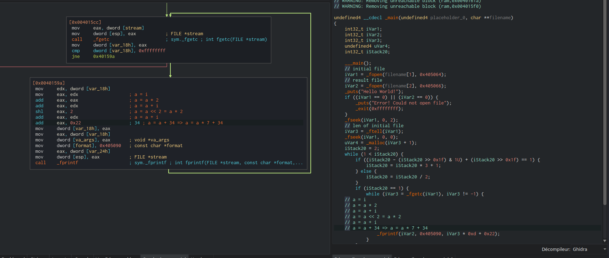
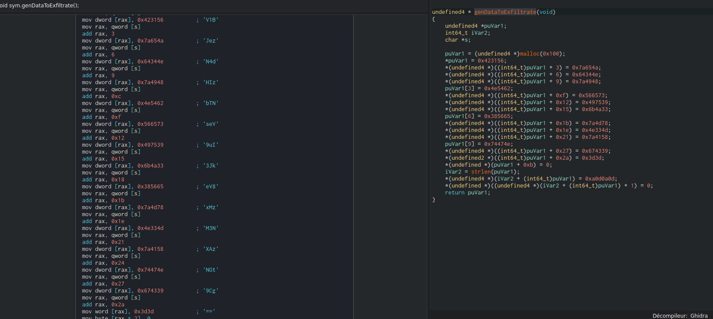
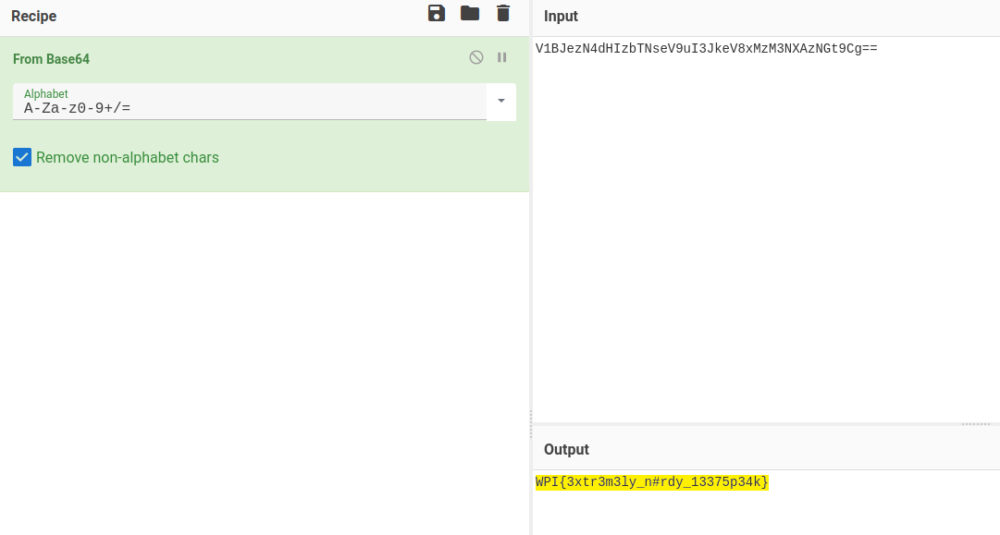
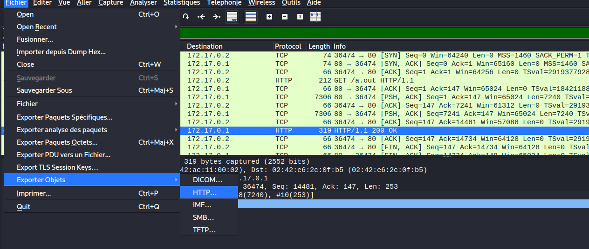
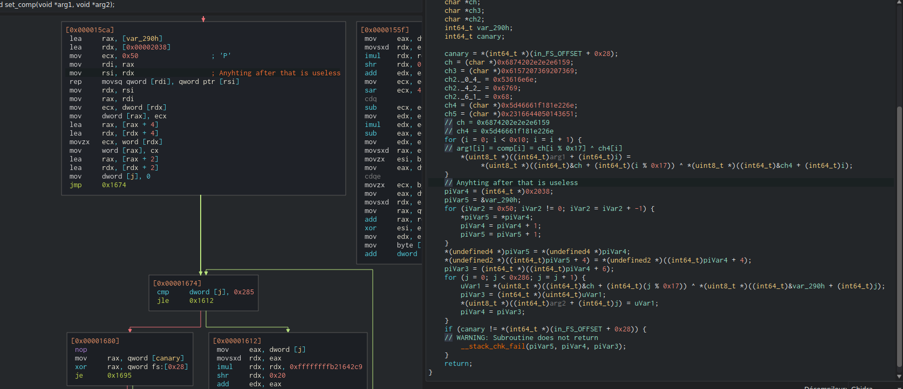
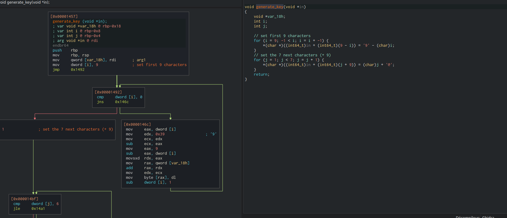
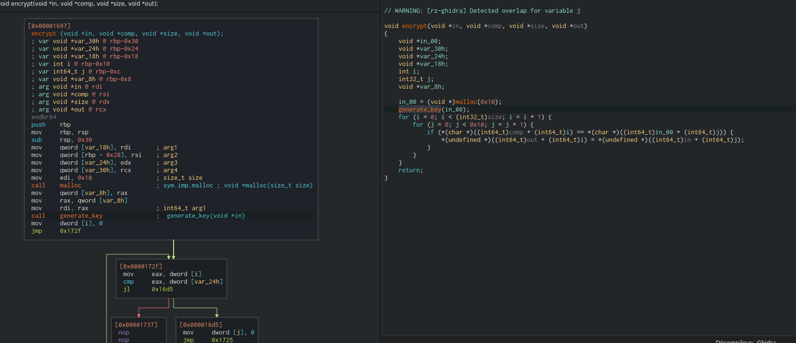
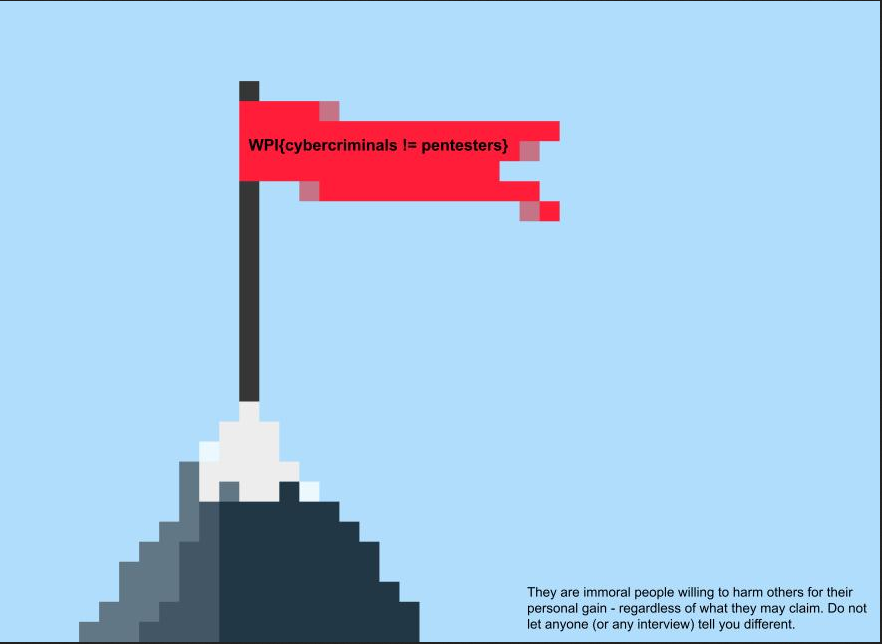

This post was written in 2022, but I had never posted it by accident. Published in October 2024.
{.note}

# Introduction

To do a small warming up before the [Purple Pill Challenge CTF](https://challenge.risksummit.fr/), we participated in the WPICTF 2022 CTF (online, hosted by [Worcester Polytechnic Institute Cyber Security Club](https://wpictf.xyz/)). Since the solved reverse challenges were a bit simple, you'll find in this post a collection of some of them rather than a single one (opposed to the tradition).

## Taylor's Serious Data

This was a (very) simple one. We were given an x64 ELF binary with a text file "songLyrics.txt" that seems encrypted. After opening the binary in [Cutter](https://cutter.re/), we can find the encryption routine in the `main` function:



As we can see in the decompiler window, the binary takes two arguments:
- An initial file path,
- A file path to store the decrypted version of the first file.

Then, the function load a file from disk (for sure the `songLyrics.txt` file), and read it. After that, it retrieves the content size of the file, and start the decryption loop. When dealing with this kind of loop, I prefer to deal with the assembly directly rather the decompiler. After a simple analysis, I found that the decryption loop was:
```r
for character c in file:
    output = c * 7 + 34
```

As we can see, the Ghidra decompiler was right (this time 😁), and we can write a simple python script that will decrypt the given file for us:
```python
file = open('./songLyrics.txt', 'r')
 
content = file.read()     
content = content.split()
for char in content:

    c = int(char)
    a = int((c - 0x22) / 0xd) 

    print(chr(a), end='', sep='')
    
file.close()
```

We then obtain the decrypted version of our file (and the filename was right, it's a song lyric):
```
...
But I got smarter, I got harder in the nick of time
[...]
Honey, WPI{TaYl0rs_v3rS1oN} I rose up from the dead, I do it all the time
I got a list of names, and yours is in red, underlined
[...]
...
```

And we get the flag `WPI{TaYl0rs_v3rS1oN}`. This was a very simple warmup, no tricky things here.

## xf1ltr80r 

Let's investigate a second challenge. We start with a x64 ELF binary, and since I liked using [Cutter](https://cutter.re/) on the previous challenge, I'll continue with it. After opening the binary, we easily find the function containing "data to exfiltrate":



The padding (`==`) at the end of the many blobs of data seem to indicate a base64 encoded string. Let's retrieve the full encoded string:
```
V1BJezN4dHIzbTNseV9uI3JkeV8xMzM3NXAzNGt9Cg==
```

We can now use [Cyberchef](https://gchq.github.io/CyberChef/) to perform the operation:



And another flag: `WPI{3xtr3m3ly_n#rdy_13375p34k}`. Very trivial.

## NeedToCough 

This is the last "easy" challenge I did and it was, in my opinion, the best one (still trivial, but the journey was nice and somehow realistic). We start the challenge with a `pcap` file that contains multiple HTTP requests and an encrypted file that was a `jpg` image. After analyzing some frames, I found that these requests contained a file. Therefore, I exported it using Wireshark:



I obtained (again) a nice x64 ELF binary file. Since it worked well for the previous challenges, I stayed with [Cutter](https://cutter.re/) here, and analyzed the code. After a high level review on the disassembly, I found that the majority of the code was garbage about a notice drop (ransomware-like), so I focused on the encryption loop. I found four interesting functions:
- One that converts an input to hexadecimal code,
- A second that generates a hexadecimal table (for the permutation),
- An encryption function that uses a permutation table (over hexadecimal),
- And a last one that generates the permutation table.

The part that generates the permutation table is at the beginning of a function that also deals with the notice part (useless here):



As I said before, I prefer to look at the assembly rather than the decompiler code (especially when you see how little code is present). I extracted this pseudo-code used to generate the permutation table:
```r
for i in [0,16]:
    output[i] = key1[i % 0x17] ^ key2[i]
```

I then successfully extracted the two keys `key1` and `key2` from the binary:
```python
# Extracted key1
key1_first = '6874202e2e2e6159'
key1_second = '6157207369207369'
```

Since we were in little endian, we needed to convert it before concatenation:
```python
# Convert it since we are in little endian
key1_first = bytearray.fromhex(key1_first)
key1_first.reverse()
key1_second = bytearray.fromhex(key1_second)
key1_second.reverse()
key1 = key1_first + key1_second
```

We do the same with the `key2`:
```python
# Extracted key2
key2_first = '5d46661f181e226e'
key2_second = '2316644050143651'

# Convert it since we are in little endian
key2_first = bytearray.fromhex(key2_first)
key2_first.reverse()
key2_second = bytearray.fromhex(key2_second)
key2_second.reverse()
key2 = key2_first + key2_second
```

We can now recreate the algorithm that generates the permutation table:
```python
# Generate the permutation table from the two keys
permutation_table = [None] * 16
for i in range(0x10):
    permutation_table[i] = chr(key1[i % 0x17] ^ key2[i])
```

Then, we can continue with another easy part, by analyzing the hexadecimal table generation code:



We can translate this assembly function to python:
```python
table = [None] * (9 + 7)

# First loop, for the first 9 characters
for i in range(9, -1, -1):
    table[9 - i] = chr(ord('9') - i)

# Second loop, for the 7 remaining characters
for i in range(1, 7, 1):
    table[9 + i] = chr(i + ord('@'))
```

As we can see, it's a complicated code for a simple task, in the end it just generate this string:
```
0123456789ABCDEF
```

We can now analyze the main encryption loop:



As we can see in [Cutter](https://cutter.re/), the permutation loop is very simple, and we can reconstruct it in python:
```python
for i in range(0xbeca):
    for j in range(0x10):
        if initial_image[i] == table[j]:
            encrypted_image[i] = permutation_table[j]
```

We then revert the operation and get this python code:
```python
for i in range(0xbeca):
    for j in range(0x10):
        if encrypted_image[i] == permutation_table[j]:
            initial_image[i] = table[j]
```

Since our image already contains the ASCII representation of the file content in hexadecimal, we can retrieve the initial image with this python code:
```python
# Extracted key1
key1_first = '6874202e2e2e6159'
key1_second = '6157207369207369'

# Extracted key2
key2_first = '5d46661f181e226e'
key2_second = '2316644050143651'

# Convert it since we are in little endian
key1_first = bytearray.fromhex(key1_first)
key1_first.reverse()
key1_second = bytearray.fromhex(key1_second)
key1_second.reverse()
key1 = key1_first + key1_second

# Convert it since we are in little endian
key2_first = bytearray.fromhex(key2_first)
key2_first.reverse()
key2_second = bytearray.fromhex(key2_second)
key2_second.reverse()
key2 = key2_first + key2_second

# Generate the permutation table from the two keys
permutation_table = [None] * 16
for i in range(0x10):
    permutation_table[i] = chr(key1[i % 0x17] ^ key2[i])

table = [None] * (9 + 7)

# First loop, for the first 9 characters
for i in range(9, -1, -1):
    table[9 - i] = chr(ord('9') - i)

# Second loop, for the 7 remaining characters
for i in range(1, 7, 1):
    table[9 + i] = chr(i + ord('@'))

# Comp = out = res (what we need to retrieve)
initial_image = [None] * 0xbeca

# Out = pvVar2 = encrypted (what we know)
file = open('./flag.cough', 'r')
encrypted_image = file.read()
file.close()

# Logic
for i in range(0xbeca):
    for j in range(0x10):
        if encrypted_image[i] == permutation_table[j]:
            initial_image[i] = table[j]

# Dump flag
f = open('./flag.jpg', 'wb')
f.write(flag)
f.close()
```

A tip I used to debug this script was checking that we get the magic number of JPEG files for the first bytes. This can also be used to brute force the permutation table (if you don't like reverse engineering 😉).

After running the script on the provided file (containing the encrypted image to retrieve), I obtained the initial image:



And the flag was `WPI{cybercriminals != pentesters}`!

Thanks for this well-made challenge, that were not difficult but well constructed (from Wireshark to reverse).

# Conclusion

Those reverse challenges were fun to complete even if a bit too simple. They were a good training for our big event (the [Purple Pill Challenge CTF](https://challenge.risksummit.fr/)) that were 5 days after this one. Maybe it can help someone getting into reverse 🤷‍♂️
