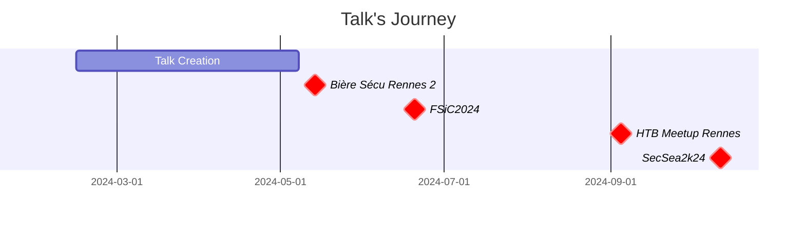
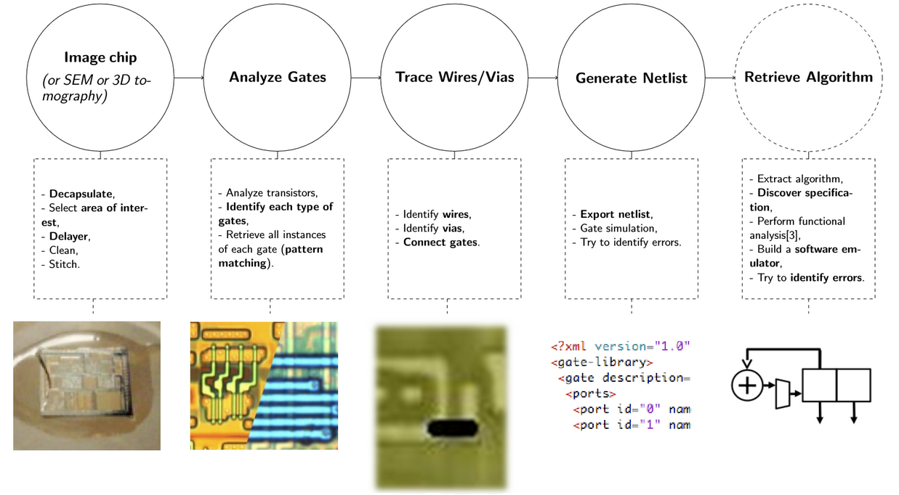
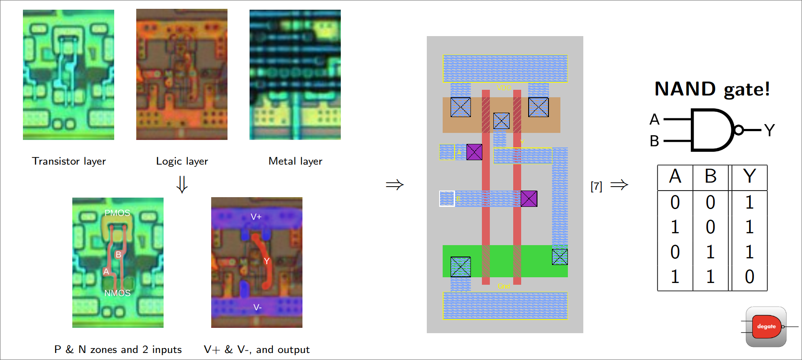
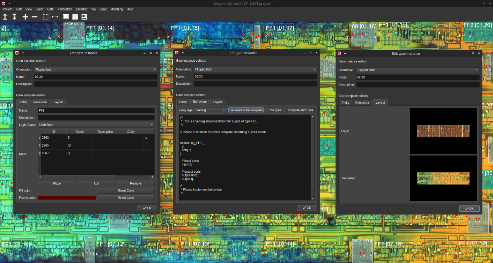
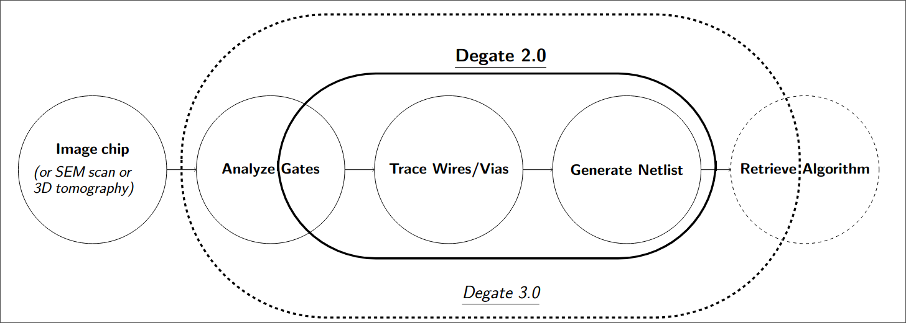
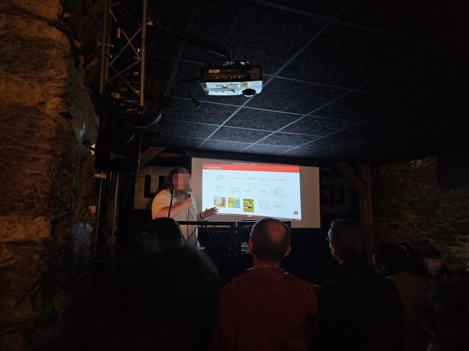
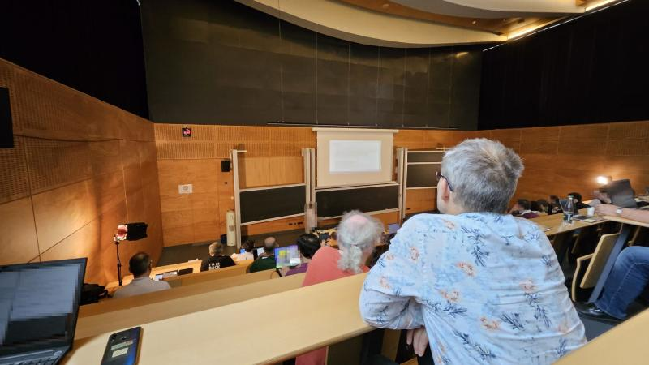
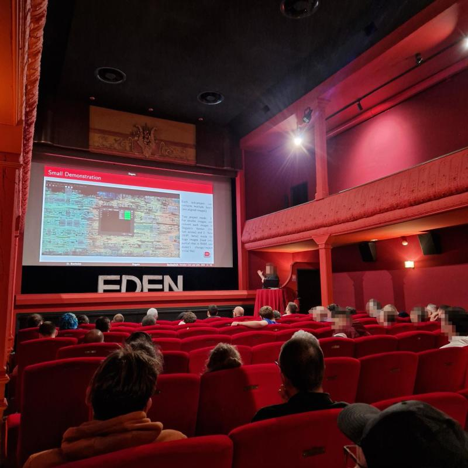

Talk PDF and sources are available [here](https://dorianb.net/talks/Degate2024/), and are under CC0 (Public Domain) license.
{.note}

My work on silicon chips reverse engineering or Degate is a hobby, and doesn't constitute my main area of expertise, and is not related to what I do professionally (mostly malware development/analysis). Everything here was done in my spare time.
{.warning}

# Introduction

In 2024, I participated in multiple conferences/events to present the silicon chips reverse engineering domain, and more precisely [Degate](https://www.degate.org). This post depicts this journey. 

To give some context on the talk, a small introduction around silicon chips reverse engineering and Degate is available below.

## Silicon Chips Reverse Engineering

To assess the security of a product or software, you can use a wide range of procedures, even under [Black Box](https://en.wikipedia.org/wiki/Black-box_testing) conditions. For example, you can use software reverse engineering to audit a proprietary firmware, perform dynamic analysis on an undocumented binary or analyze output traffic. However, when it comes to hardware implementations, things can get complicated. What can we do against a cryptographic algorithm that may be weak, but totally undocumented, and that is implemented directly into the silicon, using transistors and logic gates? Fortunately, there are some  techniques available to tackle this specific issue and retrieve information about a hardware implementation, such as [side-channel attacks](https://en.wikipedia.org/wiki/Side-channel_attack) or silicon chips reverse engineering (not exhaustive).

Side channel attacks are quite widely explored, but silicon chips reverse engineering isn't. Here the idea is to retrieve an algorithm implemented directly into the silicon, using transistors, from only a chip as base material. The process is analogous to software reverse engineering, where you start from a binary, and then retrieve assembly and then code. But here, we’ll start with a silicon chip, get images, then identify transistors, logic gates, retrieve the [netlist](https://en.wikipedia.org/wiki/Netlist) and then the underlying algorithm. Simplifying, we can see side channel attacks as dynamic analysis, and silicon chips reverse engineering as static analysis. Chips reverse engineering can be used in many different use cases, from old hardware analysis to build software emulators to intellectual property check, passing by vulnerabilities and backdoors identification. It can also be used by foundries to perform fault and failure detection, but they are not working at the same scale.

Silicon chips reverse engineering can be cut into five main steps:
1. Chip capture using decapsulation, delayering, stitching and more.
2. Transistor and gate identification.
3. Wires and vias analysis, connecting all the identified gates.
4. Netlist generation, allowing simulation and error spotting.
5. Algorithm retrieval with an additional analysis step, when the netlist is too big or too complex to be exploited directly.

The image below is summarizing that process:

To perform that process, we first need to capture the chip, this passes by decapsulation, the selection of an area of interest, delayering, cleaning and stitching. Then, we have to analyze each specific gate layout to build our gate library, starting with transistors. Using pattern matching, we can then use that library to retrieve all other gate instances. After that, we need to trace the wires and vias to connect together all the identified gates, inputs and outputs. Which will give us, after having described each gate in an HDL language, the full netlist. We can simulate that netlist to start spotting errors in the analysis. And, if the netlist is huge, we can use automated processes and methods to extract the underlying algorithm, discover specification and build a software emulator.

The below image present an example of a logic gate analysis:

Analyzing transistors is the base task of silicon chips reverse engineering, and is mostly manual work, even if it can be automated for some capture method using auto-vectorization. At first glance it can be seen as a hard process to master, but in the end transistor identification is easy with practice. In reality, the hardest challenge is wires and vias identification, which impose at least semi-automation since there is so much wires on a chip. Any mistake is very difficult to spot, and can impact the whole resulting netlist. And if you add obfuscation, like creating false wires or vias, the analysis can become a nightmare. 

If you are interested in a deeper explanation/presentation of silicon chips reverse engineering, please refer to the talk materials. I also may post a full blog post on the subject, **if there is interest**.

## Degate

As described before, silicon chips reverse engineering is a complex process that can take months. Therefore automation is the key, and here come [Degate](https://www.degate.org), a multi-platform and open source software for semi-automatic VLSI chips reverse engineering. It offers a GUI and help on multiple steps of the process of reversing a silicon chip. It’s a medium-sized software with fewer than one hundred thousand lines of codes. It supports the three major OSes and is Qt based. Translations are available for multiple language to ease the adoption. It offers many features like gate definition, gate, via and wire matching or electrical rule checks for error spotting.
 

Degate help to reverse VLSI chips by creating a gate library from your analysis, provides algorithms for template matching used for finding gate instances, can perform wires and vias matching, allows exporting netlist or can simply help navigate really huge images. Here the focus is on modern ICs with standard cells, and Degate support any 2D capture or imaging method. Hence, contrary to many commercial products, we don’t force any specific capture method and try to support as many possible.

Degate is not a new software, it has already quite a long history. Therefore, it also comes with some technical debt since we tried to follow major IC evolution, like in transistor size and count. Degate was first started by Martin Schobert during his master’s thesis, in 2007, with some famous hardware cipher analysis performed using the software. But, at the end of Martin’s thesis in 2010, a minimum maintenance period occurred. No major feature was added, and the field was quite silent. I forked the initial version of Degate in 2018 and did a major rewrite, with a near 70% code rewritten from scratch.

The current version of Degate focus on gate library system, automatic gate instances identification, and wires & vias recognition. We also fully provide netlist generation in multiple formats. However we don’t currently support transistors and gate analysis or automatic identification, and don’t help on netlist analysis. In the next major release of Degate we plan to extend that coverage.

Since 2018, I'm the official maintainer of Degate, and lead the development of the software.

# Conferences

I had the chance to be contacted by the [Free Silicon Foundation](https://wiki.f-si.org/index.php?title=Main_Page) at the start of 2024 to perform a talk on Degate at FSiC 2024. With such opportunity, I created a [support](https://github.com/DorianBDev/talks/blob/main/Degate-2024/Degate%202024.pdf) from scratch presenting silicon chips reverse engineering and Degate. I then started to perform this talk to different events and conferences, starting in May 2024 until October 2024.

The following sections present those events and conferences. Also please note that the full presentation deck is too large to fully be presented during each talk, so each time I make a presentation on the subject, the support differ a bit.

## Local events

I participated in two local events, in Rennes, namely "Bière Sécu' Rennes" (in May) and "Hack the Box Meetup" (in September). These smaller events are interesting to battle-test new talks, but are also full of profiles we don't generally see at other bigger conferences (in my opinion). This allowed many great discussions about Degate, that even were the most technical ones.

Before going to those events, and particularly to the first (Bière Sécu' Rennes), I wasn't very confident that the subject could interest anyone, since it is very technical and touch very uncommon subjects. However, I had very positive feedback from people of very different backgrounds. The introduction of the silicon chips reverse engineering field seemed to have been very appreciated, to my surprise.

As a side note, I will try to present a new talk in these local events soon (should be on malware development).

## Free Silicon Conference 2024

I had the chance to be invited by the [Free Silicon Foundation](https://wiki.f-si.org/) to give a talk in June 2024, which allowed me to discover their implication for more open chips/SoC. The F-Si Foundation is a nonprofit organization which promote Free and Open Source (FOS) Computer-Aided Design (CAD) tools/software (for integrated circuits design), hardware designs and libraries, common standards and freedom of users. Since 2019 (with a pause due to the pandemic), they organize the Free Silicon Conference at La Sorbonne in Paris. This is an international event, hence all talks are performed in English. It offers a nice mix of academic and professional people, creating nice synergy and deep technical discussions.

This was in fact my first (ever) conference (opposed to smaller local events), as a speaker **and as a participant**. The public was also not very cybersecurity oriented, and mainly focused on low (and very low) level hardware design. So it wasn't an easy journey, and was quite stressful (which impacted my English during the talk). 

This was the official abstract of the talk:
> In recent years, there has been a growing emphasis on security and trust in software and infrastructure, where security through obscurity is increasingly being countered by numerous auditing and reverse-engineering tools. In a context where many safety-critical components are implemented in hardware (TPM, cryptography, biometric authentication, crypto-asset securitization, RFID...), we cannot trust a system simply by checking and validating its software (firmware, driver...). While analyzing PCBs is accessible, going into the silicon to check implementations' security is a lot more complex and costly, but remain one of the only solution to fully trust a closed system (let aside reimplementation).
>
> Degate is an open-source tool for reverse engineering silicon chips, aimed at providing a complete workflow (from chip images to VHDL/Verilog) for community-led analysis. It can be used to understand old and recent chips, to check algorithms' implementations or to search for vulnerabilities and backdoors.
>
> This talk introduces Degate, presents the challenges of reverse engineering silicon chips and shows a real-world analysis that led to critical discoveries. We first present the importance of low-level hardware validation for security, and list the tools and products available for this task. We then outline the background and current status of Degate, and all the associated engineering and research challenges. Finally, we take the famous case of the MIFARE Classic RFID chip as an example and look at the future horizon of reverse engineering silicon chips. 

To be honest, regarding the areas of expertise of the public, I wasn't sure if my talk could interest peoples (again), but in the end I got very nice feedback (again). The silicon chips reverse engineering field is so unknown, and connect so many specialties, that it actually has a fairly large potential audience. I also had interesting interactions after the talk, which confirmed the attractiveness of the field. 

## SecSea2k24

Then, in October, I had the chance to make the closing talk of the [SecSea](https://secsea.org/) 2024 conference. It was organized by the [Hack In Provence](https://www.hackinprovence.fr/) association for its sixth edition, in the oldest cinema in the world, the Eden Cinema in La Ciotat. For me, it's a very special event since no sponsor is authorized, and everything is oriented towards the community. This allows very different subjects and approaches to be presented, and is very welcoming to new speaker. In the end, it was the perfect place to present the silicon chips reverse engineering field, even if the public was very focused on the cybersecurity domain, with only a few people with bases in electronics or physics. This might be the best experience of the year I had presenting this talk.

Once again, I got interesting feedback about my presentation, and had the chance to have [a talk on a side-channel attack](https://ninjalab.io/eucleak/) at the opening of the conference, allowing the audience to have a panoramic view of the domain. And, at my surprise, I got cited on multiple posts regarding the conference afterward, with some people describing the talk as "intellectually challenging but enriching".

This final event concluded the presentation window for this talk, although I may present it again at other venues if there is interest.

# Resources

You can find all the presentation supports of each talk on my [website](https://dorianb.net/talks/Degate2024/Events/), the "final" version [here](https://dorianb.net/talks/Degate2024/Degate%202024.pdf) and the sources on my [github](https://github.com/DorianBDev/talks/tree/main/Degate2024/Sources).





Everything (except Degate's code, which is GPLv3) is **under CC0 license**, hence **public domain**. Feel free to reuse the support, tweak it or present it, even if not crediting me. However, please note that some figures are using a specific, non-CC0, license.

# Acknowledgement

I want to thank the original author of Degate, [Martin Schobert](https://schobert.cc/), and [Starbug](https://fr.wikipedia.org/wiki/Jan_Krissler) & [Karsten Nohl](https://fr.wikipedia.org/wiki/Karsten_Nohl) for their work around silicon chips reverse engineering which inspired me a lot (and were the foundation of Degate).

I also want to thank the community around Degate, contributors and users, for keeping the project alive. And I cannot forget the wider community around the domain of silicon chips reverse engineering, with [John McMaster](https://siliconpr0n.org/), [Ken Shirriff](https://www.righto.com/), [ZeptoBars](https://zeptobars.com/) or all the others.

And finally, the last releases of Degate were **partially sponsored by [Anton Kochkov (XVilka)](https://github.com/XVilka)**, such as the work for this talk. A very huge thank to him.

# References

- *Mirko Holler, Manuel Guizar-Sicairos, Esther H. R. Tsai, Roberto Dinapoli, Elisabeth Muller, Oliver Bunk, Jorg Raabe, and Gabriel Aeppli.* **High-resolution non-destructive three-dimensional imaging of integrated circuits. Nature, 543(7645):402–406, March 2017.**
- *Starbug Karsten Nohl.* **Pacsec silicon conference. 2009.**
- *Nils Albartus Ran Ginosara Avi Mendelson Leonid Azriel, Julian Speith and Christof Paar.* **A survey of algorithmic methods in IC reverse engineering. Cryptology ePrint Archive, Paper 2021/1278, 2021.**
- *John McMaster.* **Siliconpr0n, https://siliconpr0n.org/.**
- *Karsten Nohl, David Evans, and Henryk Plotz.* **Reverse-Engineering a Cryptographic RFID Tag. page 9.**
- *Martin Schobert.* **Gnu software degate. Webpage: http://www.degate.org**
- *Berlin Security Research Labs.* **Siliconzoo, http://siliconzoo.org.**
- *Ken Shirriff.* **Ken shirriff’s blog, https://www.righto.com/.**
- *Mikhail Svarichevsky.* **Zeptobars, https://zeptobars.com/en/.**
- *Zonenberg Andrew Yener Bulent.* **Csci 4974/6974 hardware reverse engineering, 2014.**
